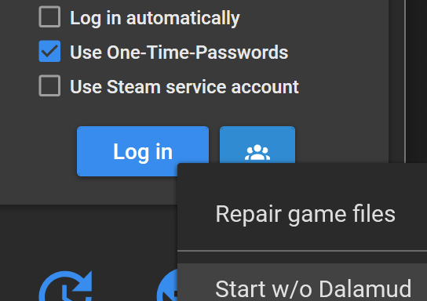
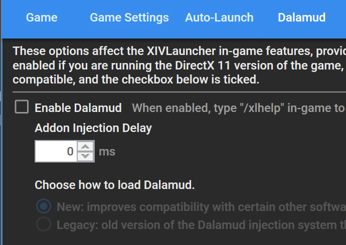

# 构建 Dalamud

:::tip

本指南介绍如何从源代码构建 Dalamud，适用于对 Dalamud 本身进行更改的人。

**如果您只是想创建插件，则无需遵循本指南！** 您可以跳过本节，前
往[插件开发](/category/plugin-development)部分。

:::

Dalamud 使用 [Nuke](https://nuke.build) 构建，这是一个用于 C#/.NET 项目的代码优
先构建系统。本指南将指导您设置开发环境并构建 Dalamud。

## 先决条件

- Windows 10/Windows Server 2016 或更高版本
- [Visual Studio 2022](https://visualstudio.microsoft.com/vs/)
  - 需要安装 "使用 C++ 的桌面开发" 和 "使用 .NET 的桌面开发" 工作负载。
- [.NET 7.0 SDK](https://dotnet.microsoft.com/download/dotnet/7.0)
  - 这已包含在 Visual Studio 2022 中，但如果需要，也可以单独安装。
- [Git](https://git-scm.com/downloads)

## 获取源代码

Dalamud 的源代码托管在 GitHub 上。您可以使用以下命令克隆存储库：

```shell
git clone --recursive https://github.com/goatcorp/Dalamud.git
```

:::info

Dalamud 有几个 Git 子模块。如果您没有使用 `--recursive` 标志克隆存储库，则需要使
用以下命令手动初始化子模块：

```shell
git submodule update --init --recursive
```

您还可以使用此命令稍后更新本地存储库中的子模块。

:::

## 构建

在 PowerShell 中，导航到存储库的根目录并运行以下命令：

```pwsh
.\build.ps1
```

这将构建 Nuke 项目并运行默认目标，该目标将构建 Dalamud 及其所有组件（包括注入器
）。

:::tip

您也可以尝试直接使用 MSBuild 或您的 IDE 的构建系统构建 Dalamud。但是，CI 构建使
用 Nuke，因此如果遇到任何问题，您应该尝试使用 Nuke 进行构建以排除构建系统问题。

:::

:::info

目前不支持在其他操作系统上构建，因为依赖于 Windows API 的本机组件（例如注入器）
。

但是，您可以尝试使用 `./build.sh` 而不是 `.\build.ps1` 或直接使用 `dotnet build`
构建 `Dalamud` 项目，在 Linux/macOS 上进行 _部分_ 构建。

:::

## 运行

:::danger

如果您使用这些说明来绕过游戏补丁后的 Dalamud 禁用，**您将自行承担风险！**

我们在每次补丁后禁用 Dalamud，直到它以相对稳定和安全的方式得到验证。如果您选择忽
略此警告，您将会遇到崩溃和其他问题，我们将不会为您提供帮助。

再次强调：**手动将 Dalamud 注入运行中的游戏仅供开发人员使用！** 如果您想在补丁后
帮助我们测试 Dalamud 和插件，请加入 Discord 并选择测试人员角色。我们需要帮助时会
通知您。

:::

构建过程将注入器输出到 `bin\Debug\Dalamud.Injector.exe`。

为了测试目的，您可以以几种不同的方式使用此注入器。

### 模拟启动

如果您想在不完全登录游戏的情况下测试 Dalamud，则可以使用注入器的“模拟启动”功能。
这将启动游戏，但不进行任何身份验证，因此您将无法进入游戏。

要使用此功能，您应确保游戏未运行，然后使用以下参数运行注入器：

```shell
.\Dalamud.Injector.exe launch -f
```

:::caution

如果您的游戏安装在非标准位置，则必须使用 `-g` 参数传递 `ffxiv_dx11.exe` 的完整路
径，例如：

```shell
.\Dalamud.Injector.exe launch -f -g "D:\dev\ffxiv\game-root\game\ffxiv_dx11.exe"
```

:::

### 手动注入

要完全测试 Dalamud，您需要将其注入到正在运行的游戏中。为此，您需要确保以禁用其
ACL 保护的方法启动游戏。通过官方启动器启动将不允许您注入 Dalamud。

XIVLauncher 是此操作的推荐方法，因为它会自动为您禁用 ACL 保护。只需通过
XIVLauncher 启动游戏，并确保使用以下选项之一禁用 Dalamud 注入：

- 右键单击“登录”按钮，然后选择“Start w/o Dalamud”。
  
- 在 XIVLauncher 设置中禁用 Dalamud。
  

游戏运行后，您可以使用以下参数运行注入器：

```shell
.\Dalamud.Injector.exe inject -a
```

Dalamud 现在应该已经被注入到游戏中。您可以通过查看屏幕左上角的 Dalamud 徽标来验
证此操作（假设您尚未登录）。

:::tip

您可以使用 `help` 命令调用注入器以查看所有可用参数：

```shell
.\Dalamud.Injector.exe help
```

大多数额外的参数都不会有帮助，但它们在帮助输出中轻微地记录，以保证完整性。

:::
